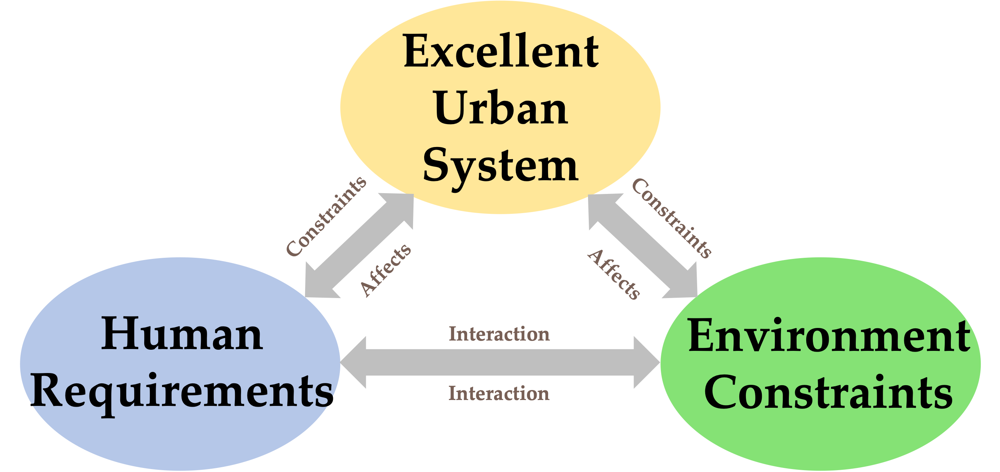
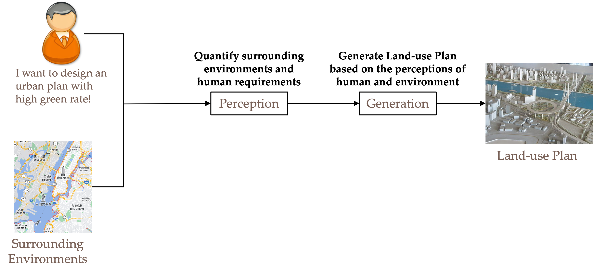
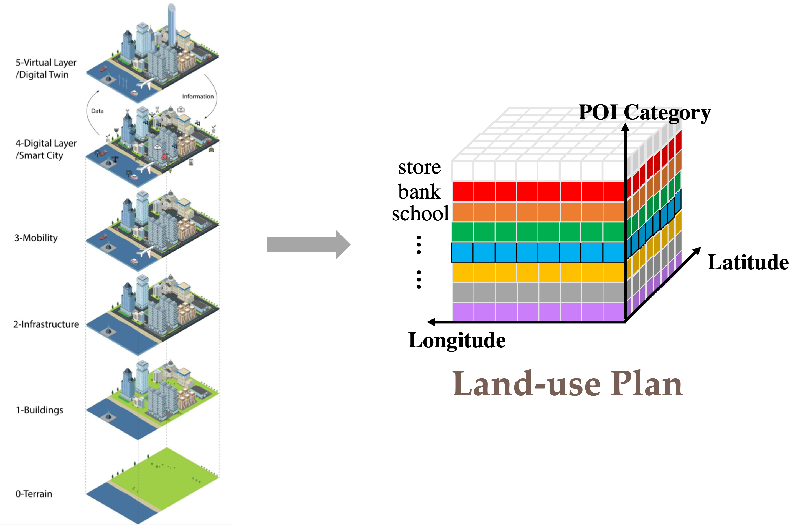

# Deep Generative AI for Automated Urban Planning

Urban planning is vital for building up a sustainable and vigorous community. As a complicated and time-consuming task, traditional practice heavily depends on experts' personal experiences. The variance among urban planners may result in biases and implausible solutions. Thanks to the explosive development of deep learning and internet-of-things, the handful of methodologies and ubiquitously available geo-social, urban, and mobile data provide us with a new data-driven perspective to re-investigate urban planning.

After analyzing the conventional urban planning process, it becomes evident that an excellent urban plan can address both human requirements and environmental constraints to foster a harmonious and environmentally friendly solution. Thus, based on this observation, we propose a generic automated urban planning framework, as depicted in the following figure.

This framework includes two key components: Perception and Generation. The perception module aims to perceive the meaning of human experts and surrounding contexts and the generation module generates ideal urban plan according to the comprehension.

The primary challenge in this field lies in the clear definition of urban planning. In our research, we introduce a 3-dimensional tensor to represent the land-use configuration, illustrated as follows:

To be more specific, for an empty geographical area, we divide it into N*N squares. Then, we count the number of Points of Interest (POIs) according to their categories to create a distribution. Subsequently, we stack these distributions together to form the land-use configuration plan.

---

We have published a series of papers, and we will outline the progression as follows. The relevant paper, code, and data will be provided for reference.

<h3><b>1. Solely considering environmental constraints.</b></h3>

* **(SIGSPATIAL 2020)** Reimagining City Configuration: Automated Urban Planning via Adversarial Learning
[[Paper](https://arxiv.org/abs/2008.09912)] [[Code&Data](https://www.dropbox.com/scl/fo/hudgsilk6myqfxuu6lz3a/h?dl=0&rlkey=610fr3k0pavza3bag51gzihvb)]

* **(TSAS)** Automated Urban Planning for Reimagining City Configuration via Adversarial Learning: Quantification, Generation, and Evaluation 
[[Paper](https://arxiv.org/abs/2112.14699)]

<h3><b>2. Considering both environmental constraints and human requirements.</b></h3>

* **(ICDM 2021)** Deep Human-guided Conditional Variational Generative Modeling for Automated Urban Planning
[[Paper](https://arxiv.org/pdf/2110.07717.pdf)] [[Code&Data](https://www.dropbox.com/scl/fo/7a416ys4njgwa25nqjjzb/h?dl=0&rlkey=sdl5e8eckeoe0w0lsykdbpl6p)]

<h3><b>3. Besides human and environmental factors, taking hierarchical relations in urban planning into account.</b></h3>

* **(AAAI 2023)** Human-instructed Deep Hierarchical Generative Learning for Automated Urban Planning
[[Paper](https://ojs.aaai.org/index.php/AAAI/article/view/25589)] [[Code&Data](https://www.dropbox.com/scl/fo/win4kptpf345ire8zdfnm/h?dl=0&rlkey=s3v7g214rte00x96bxuxcwhqt)]

* **(SDM 2023)** 	
Hierarchical Reinforced Urban Planning: Jointly Steering Region and Block Configurations
[[Paper](https://epubs.siam.org/doi/abs/10.1137/1.9781611977653.ch39)]

* **(SDM 2024)** Dual-stage Flows-based Generative Modeling for Traceable Urban Planning
[[Paper](https://arxiv.org/abs/2310.02453)] 

* **(KAIS)** Automated Urban Planning aware Spatial Hierarchies and Human Instructions
[[Paper](https://link.springer.com/article/10.1007/s10115-022-01801-6)]

Additionally, we have envisioned the future trend in the field of automated urban planning.

* Towards Automated Urban Planning: When Generative and ChatGPT-like AI Meets Urban Planning
[[Paper](https://arxiv.org/pdf/2304.03892.pdf)]

To encourage other researchers to implement their own ideas in this domain, we have also made the [raw data](https://www.dropbox.com/sh/tgc3oe9eufadfwn/AADrSREeqkKdz9aEjW1eVrXqa?dl=0) and [raw features](https://www.dropbox.com/sh/wpb4l06ajuj9lc5/AAAywWILuBhvu8XMXD5WYnOda?dl=0) available for release.

